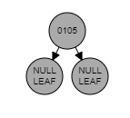
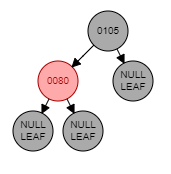
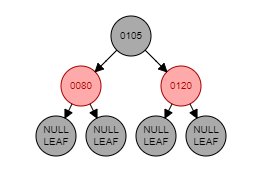
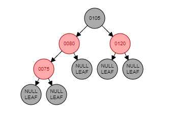
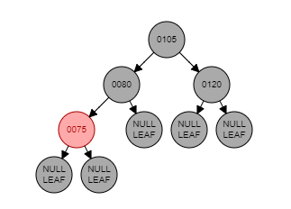
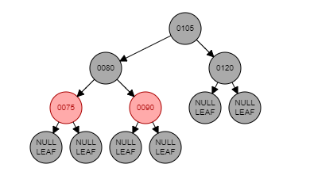
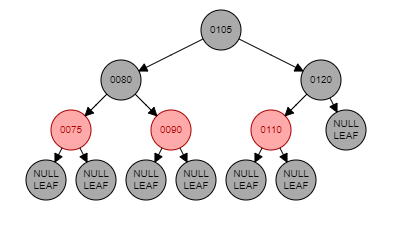
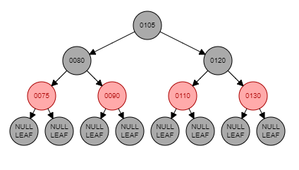

# Árvore Rubro Negra Consulta e Aluguel de Livros
    

## Resumo
---

 O algoritmo em questão tem por finalidade representar um sistema de uma biblioteca utilizando da estrutura de dados Árvore Rubro Negra, onde é possível realizar tanto a consulta da disponibilidade de algum livro quanto o aluguel de um livro.

 ## Objetivo
---
 O objetivo desse projeto é prover um sistema de uma biblioteca no qual é possível fazer consultas de disponibilidade de livros e aluguéis dos mesmos.A estrura Árvore Rubro Negra foi utilizada, visto que para inserção e remoção de livros ela possui um desempenho melhor que o da Árvore AVL, sendo que a AVL por ser mais balanceada exige mais operações para o balanceamento, o que gera um custo maior.Embora a Rubro Negra tenha um desempenho menor no quesito busca de um elemento, para uma pequena massa de dados ela tem um desempenho consideravelmente bom, portanto ela foi utilizada, se fosse um projeto com uma massa de dados maior a estrutura mais recomendada seria a AVL.

## Funcionamento e Informações sobre a Árvore RN
---
A árvore Rubro Negra também é um tipo de árvore binária balanceada.Entretanto, diferentemente da árvore AVL que utiliza da altura de suas subárvores, a Rubro Negra faz uso de uma maneira de coloração dos nós para manter o balanceamento da árvore.

Para o balanceamento da árvore devem ser consideradas 7 propriedades das Árvores Rubro Negras que são:

1. Todo nó da árvore é vermelho ou preto.
1. A raiz é sempre preta.
1. Todo nó folha define seus filhos em NULL como sendo pretos.
1. Se um nó é vermelho, então ambos os vizinhos(pai e tio) são pretos.
1. Para cada nó, todos os caminhos deste nó até os nós folha descendentes apresentam a mesma quantidade de nós pretos.
1. Se um nó é vermelho, então os seus filhos são pretos(ou seja, não existem nós vermelhos consecutivos).
1. Para cada nó inserido, o nó criado começa com a cor vermelha.

Três casos devem ser considerados para o balanceamento da árvore RN são eles:

1. A inserção de um nó vermelho deve garantir que seu pai e o tio sejam pretos.
1. O tio de um nó é preto, o nó e seu pai são vermelhos e o nó é o filho da direita.
1.  O tio de um nó é preto, o nó e seu pai são vermelhos e o nó é o filho da esquerda.

Para manter o balanceamento, a árvore RN faz o uso de rotações e ajustes de cores no processo de rebalanceamento, que acontece a cada inserção ou remoção.

O objetivo das operações de rotação e ajuste de cores é garantir que a cada inserção ou remoção as propriedades da árvore RN não sejam violadas, o que permite que o balanceamento da árvore RN seja restituído.

No sistema de biblioteca foram inseridos 7 códigos ISBN de livros para a key da struct Record e em seguida 7 títulos de livros para o value da struct Record,correspondentes aos código ISBN.Para tanto, uma operação de inserção utiliza de um código ISBN e um título de livro a cada interação e de um ponteiro tree do tipo struct Tree, o método de inserção rebalanceia a árvore conforme ocorra a violação de alguma propriedade da árvore RN.Há outras operações disponíveis como o aluguel de livro(remoção do livro), que utiliza do código ISBN digitado pelo usuário e de um ponteiro tree do tipo sruct Tree, e logo em seguida remove o respectivo nó (código ISBN) da árvore assim como a inserção esse código garante o rebalanceamento a cada remoção , conforme surge alguma infração das propriedades da árvore RN.Por fim, o método de consulta de livros utiliza um ponteiro tree e um ponteiro aux( que irá armazenar o endereço do nó(código ISBN do livro que quero consultar) também do tipo struct Tree, e de um record do tipo sruct Record que será o código ISBN do livro que quero consultar. 

## Exemplo de inserção na Árvore Rubro Negra
---
A seguir será apresentado um exemplo de inserção de um código ISBN de um livro, na aplicação do sistema da biblioteca.

A árvore a seguir contem 7 nós sendo eles: {105, 80, 120, 75, 90, 110, 130}

Inserção do código ISBN (105) na árvore RN:

- A propriedade 2 garante que o nó raiz sempre é preto e nenhuma violação de propriedade é violada até então.

Inserção do código ISBN (80) na árvore RN:

- A propriedade 7 garante que a cada nó inserido a sua cor é vermelha e nenhuma propriedade é violada até então.

Inserção do código ISBN (120) na árvore RN:

- A propriedade 7 garante que a cada nó inserido a sua cor é vermelha e nenhuma propriedade é violada até então.

Inserção do código ISBN (75) na árvore RN:

- Ao ser inserido o nó 75 é garantido pela propriedade 7 sua cor vermelha, porem há uma violação da propriedade 4 o que se torna necessario uma mudança de cor nos nós pai e tio do nó 75 tornando-os pretos.

- Correção da violação da propriedade 4

Inserção do código ISBN (90) na árvore RN:

- A propriedade 7 garante que a cada nó inserido a sua cor é vermelha e nenhuma propriedade é violada até então.

Inserção do código ISBN (110) na árvore RN:

- A propriedade 7 garante que a cada nó inserido a sua cor é vermelha e nenhuma propriedade é violada até então.

Inserção do código ISBN (130) na árvore RN:

- A propriedade 7 garante que a cada nó inserido a sua cor é vermelha e nenhuma propriedade é violada até então.
## Instalação do Repositório
---
   
    $ git clone https://github.com/PatrickSilvaMenezes/Arvore_Rubro_Negra.git ArvRN
    $ cd ArvRN

## Compilação
---
Na pasta ArvRN abra o terminal e digite os seguinte comandos para limpar o lixo da antiga pasta build,compilar e posteriormente executar:

    $ make clean    
    $ make
    $ make run

## Conclusão e Resultados Finais
---
A partir da implementação da estrutura de dados árvore Rubro Negra foi possível perceber o desempenho dela para o sistema de consulta e aluguel de livros, sendo que para inserção e aluguel de livros o custo é log(n), tendo em vista que n é a quantidade de nós(livros) presentes na árvore.

Embora a árvore seja uma boa opção para inserir livros e alugá-los(remove-los), não é a mais recomendada para a função de consulta da disponibilidade de algum livro, ou se ele tem na biblioteca no caso se há esse nó(código ISBN do livro) na árvore.Apesar disso, se tratando de um conjunto de massa de dados pequeno ela se comporta bem não havendo perda significativa de desempenho e nem aumento de custo computacional considerável.

## Referências
---
### Livros
 - [Estrutura de dados descomplicada: em linguagem C/AndréRicardo Backes.1 ed-Rio de Janeiro: Elsevier,2016](https://www.amazon.com.br/Estrutura-Dados-Descomplicada-Linguagem-Backes/dp/8535285237)
 - [T.Cormen, et al,Algoritmos: Teoria e Prática,3 ed-Rio de Janeiro: Elsevier,2009](https://www.amazon.com/Introduction-Algorithms-3rd-MIT-Press/dp/0262033844/ref=sr_1_1?dchild=1&keywords=Introduction+to+Algorithms&qid=1613858932&sr=8-1)

### Site para simulação da RN
- [Simulador Árvore Rubro Negra](https://www.cs.usfca.edu/~galles/visualization/RedBlack.html)
### Sites
- [Ime Usp](https://www.ime.usp.br/~song/mac5710/slides/08rb.pdf)
- [Wikipedia](https://pt.wikipedia.org/wiki/Árvore_rubro-negra)